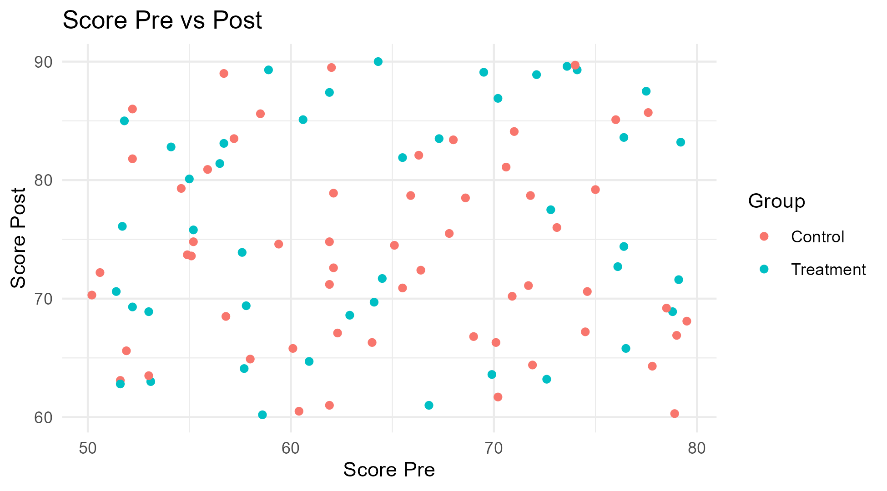

1. Check library loading correctness:

```{r libraries}
library(dplyr)
library(ggplot2)
library(DBI)
library(RSQLite)
library(rmarkdown)
library(writexl)


if (!all(c("dplyr", "ggplot2", "DBI", "RSQLite", "rmarkdown", "writexl") %in% .packages())) {
  stop("Some libraries failed to load.")
} else {
  cat("All libraries loaded successfully.\n")
}

```

2. Simulate the data and display header:

```{r oq_data}
set.seed(123)
simulated_data <- data.frame(
  ID = 1:100,
  Group = sample(c("Control", "Treatment"), 100, replace = TRUE),
  Age = round(runif(100, 20, 60), 0),
  Score_Pre = round(runif(100, 50, 80), 1),
  Score_Post = round(runif(100, 60, 90), 1)
)

head(simulated_data)
```

3. Data manipulation:
- Create a new column for score difference
- Merge the data with a new table
- Filter for Treatment group only
- Display header.

```{r data_manipulation}
manipulated_data <- simulated_data %>%
  mutate(Score_Diff = Score_Post - Score_Pre)

extra_data <- data.frame(
  ID = sample(1:100, 50),
  Extra_Info = sample(c("High", "Low"), 50, replace = TRUE)
)
merged_data <- manipulated_data %>%
  left_join(extra_data, by = "ID")

filtered_data <- merged_data %>%
  filter(Group == "Treatment")

head(filtered_data)
```

4. Statistical analysis:
- Perform a t-test on Score_Diff between Control and Treatment groups.

```{r analysis}
t_test_result <- t.test(
  Score_Diff ~ Group,
  data = manipulated_data
)
print(t_test_result)
```

- Perform a linear regression and ANOVA on Score_Pre and Score_Post.

```{r regression_anova}
regression_model <- lm(Score_Post ~ Score_Pre + Group, data = simulated_data)
summary(regression_model)
```

- Perform ANOVA on Score_Post between Control and Treatment groups.

```{r anova}
anova_result <- aov(Score_Post ~ Group, data = simulated_data)
summary(anova_result)
```

5. Graphical representation:

```{r graph, fig.width=6.5, fig.height=3.6}
scatter_plot <- ggplot(simulated_data, aes(x = Score_Pre, y = Score_Post, color = Group)) +
  geom_point() +
  labs(title = "Score Pre vs Post", x = "Score Pre", y = "Score Post") +
  theme_minimal()
print(scatter_plot)
```

6. Check correctness of data export as .png and subsequent reporting:

```{r data_export_plot}
# Save the plot
ggsave("scatter_plot.png", scatter_plot, width = 6.5, height = 3.6)
```

```{r embed_plot, echo=FALSE, fig.cap="Scatter plot of Score Pre vs Post"}
# Embed the saved scatter plot image

```

7. Check correctness of data export as .xlsx:

```{r data_export_xlsx}
# 5. Data Export and Reporting
# Export data to Excel
write_xlsx(manipulated_data, "manipulated_data.xlsx")

# Check if the file exists in the current working directory
if (file.exists("manipulated_data.xlsx")) {
  cat("The file 'manipulated_data.xlsx' exists in the working directory.\n")
} else {
  cat("The file 'manipulated_data.xlsx' does NOT exist in the working directory.\n")
}

```

